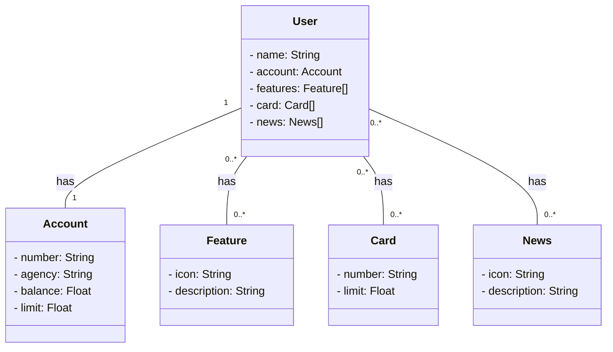

# santander-dev-week-2023
Java RESTful API criada para a Santader Dev Week 2023 com a DIO

## Diagrama de Classes

```mermaid

classDiagram
  class User {
    - name: String
    - account: Account
    - features: Feature[]
    - card: Card[]
    - news: News[]
  }

  class Account {
    - number: String
    - agency: String
    - balance: Float
    - limit: Float
  }

  class Feature {
    - icon: String
    - description: String
  }

  class Card {
    - number: String
    - limit: Float
  }

  class News {
    - icon: String
    - description: String
  }

  User "1" -- "1" Account : has
  User "0..*" -- "0..*" Feature : has
  User "0..*" -- "0..*" Card : has
  User "0..*" -- "0..*" News : has
```
